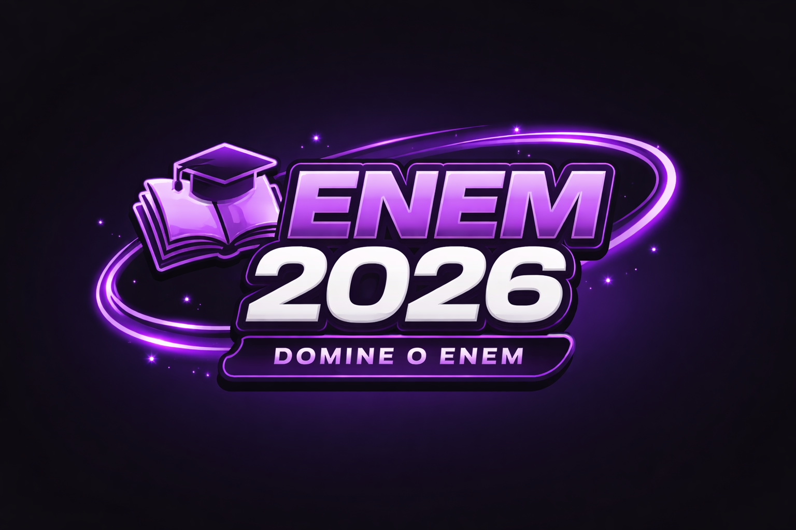

  

<h1 align="center">Projeto ENEM 2026 🎓</h1>

  <strong>Plataforma EdTech Inteligente focada na preparação de alta performance para o ENEM.</strong> 
  <em>Arquitetura escalável, Inteligência Artificial generativa e Experiência de Usuário Premium.</em>

  
  
  
  
  

---

## 🚀 Sobre o Projeto

O **Projeto ENEM 2026** transcende uma simples plataforma de estudos. É um sistema educacional completo, impulsionado por IA, arquitetado para fornecer ao aluno a melhor infraestrutura tecnológica e acompanhamento cognitivo.

Do suporte a rotinas de estudo à avaliação automatizada de desempenho e mentoria via agentes digitais integrados, a aplicação foi pensada desde o início para resolver os maiores atritos na preparação de estudantes brasileiros.

## 🏗️ Arquitetura e Engenharia

A plataforma foi concebida utilizando as metodologias e ecossistemas mais modernos do mercado de desenvolvimento de software moderno:

- **Serverless First:** Hospedagem otimizada para bordas e integração direta com bancos de dados serverless (Neon DB), gerando respostas com latência ultrabaixa.
- **SSR e SSG Avançados:** O uso do `Next.js 14` otimiza o SEO, agiliza a entrega do TTI (Time to Interactive) e reduz gargalos no `client-side`.
- **Validação de Contratos Strict:** `TypeScript` e `Zod` asseguram consistência entre os tipos de ponta a ponta (Fullstack Type Safety).
- **Segurança e Autenticação:** Uma robusta camada baseada em `NextAuth v5` protege senhas em Hashed Hash bcrypt e implementa controle robusto de sessão e "Matrícula Blindada".

## 🛠️ Stack Tecnológico

Um overview das engrenagens desta plataforma:

### Core & Frontend
- **Framework:** [Next.js 14](https://nextjs.org/) (App Router, Server Components e Server Actions)
- **Linguagem:** [TypeScript](https://www.typescriptlang.org/) `v5` (Totalmente tipado e *strict*)
- **Biblioteca de Interface:** [React](https://reactjs.org/) `v18`
- **Estilização e Design System:** [Tailwind CSS](https://tailwindcss.com/) com `clsx` e `tailwind-merge` para construção modular e flexível
- **Micro-interações:** [Framer Motion](https://www.framer.com/motion/) gerenciando animações complexas, físicas espaciais do cliente e renderizações elegantes
- **Ícones:** [Lucide React](https://lucide.dev/)
- **Charts:** [Recharts](https://recharts.org/) (Dashboards interativos de performance do aluno)

### Backend, Dados & Auth
- **Padrão de Autenticação:** [NextAuth.js v5 (Auth.js)](https://authjs.dev/) - Sistema seguro que integra credenciais em BD Próprio e *Google OAuth* em fluxo condicional de acesso
- **Banco de Dados:** [Neon Database (PostgreSQL Serverless)](https://neon.tech/)
- **ORM:** [Prisma](https://www.prisma.io/) acelerando a modelagem, migração de dados e segurança anti-SQL injection
- **Criptografia:** `bcryptjs`
- **Mensageria/Emails:** `Resend` & `Nodemailer` iterados para comunicação e onboarding de matrículas automáticas

### Intelectual da Plataforma (Inteligência Artificial)
- **Motor Cognitivo Principal:** Google **Gemini** Framework e *Groq* Llama3 para modelos de Inferência ultrarrápidos (usando `@google/generative-ai` e `ai/sdk`)
- **Vercel AI SDK:** SDK dedicado para lidar com fluxos de _streaming_ e gerenciamento de contexto conversacional fluídos.
- **Machine Vision:** Capacidade da IA de receber anexos visuais para interagir com prints e dúvidas do aluno nativo ao chat tutor.

## 🌟 Principais Funcionalidades

1. **Dashboard de Análise Cognitiva:** Dados sobre engajamento de simulados, tempos e metas calculados e renderizados dinamicamente via `server-driven data`.
2. **IA Tutor Floating (Drag & Drop):** Agente de tutoria inteligente onipresente alimentado pela engine do Gemini com suporte a imagens, animações Framer Motion baseada em física (`spring`) e UI/UX imersiva no conceito de Glassmorphism.
3. **Plataforma de Matrícula Blindada:** Lógica avançada para intercepcão de Auto-Registro que força usuários novos a completarem o flow manual antes da liberação de logins single-step via Google (Fluxo de segurança e aquisição qualificada).
4. **God Mode / Administração System:** Sessões hierárquicas que distinguem o criador e dão permissão de `dev view`, pontuação ilimitada e acesso analítico completo a logs via UI dedicada.
5. **Automação de Resumo de IA:** Pipelines de Chat otimizados via streaming (OpenAI format compatible API endpoints) que mantêm histórico completo persistente no Server.

---

## 👨‍💻 Desenvolvedor & Visão Técnica

Este repositório atesta boas práticas de Engenharia de Software, incluindo:
*   Componentização Avançada (Lógica isolada, Custom Hooks, separação de Server & Client borders)
*   Desempenho rigorosamente auditado para evitar *hydration mismatches*
*   Otimização mobile-first levada a sério
*   Utilização real e otimizada de Inteligência Artificial em contextos de negócio viáveis

 

  <i>Construído com Next.js, Framer Motion e muito café. Código focado no impcto real à educação.</i>

